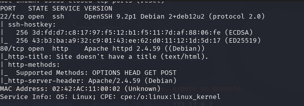
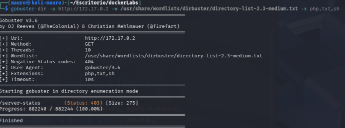
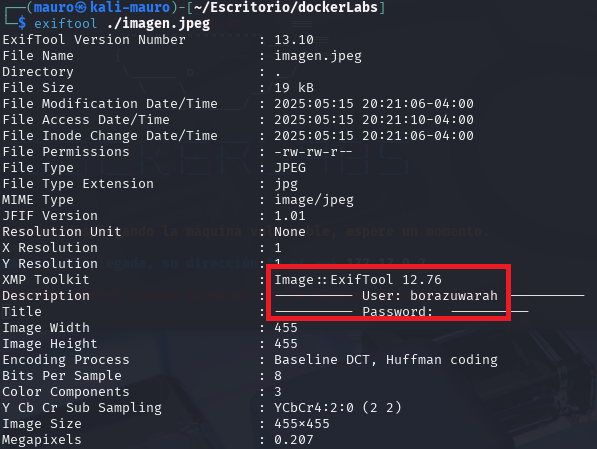
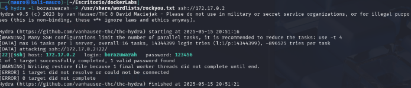
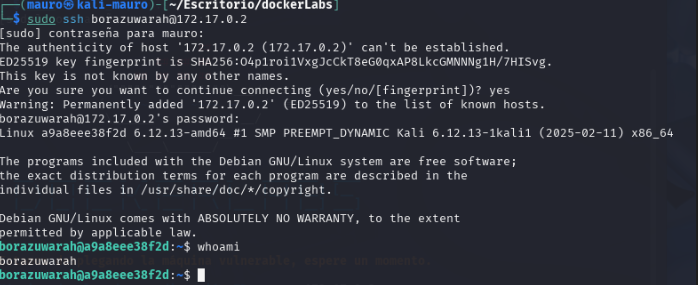
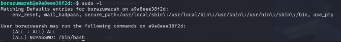
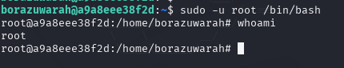

En esta práctica resolveremos una máquina de **DockerLabs** en la que aplicaremos técnicas de **esteganografía** para descubrir **datos ocultos dentro de una imagen**. Dichos datos, presentes en los **metadatos del archivo**, nos proporcionarán la información necesaria para avanzar en el análisis y finalmente **vulnerar la máquina**.


Empezaremos haciendo un escaneo de puertos a la maquina **BorazuwarahCTF** con la herramienta **Nmap**

```
 sudo nmap -p- --open -sSCV --min-rate 5000 -Pn -n -v 172.17.0.2 -oN escaneo
```

| Parte             | Significado                                                                                                                                                                                               |
| ----------------- | --------------------------------------------------------------------------------------------------------------------------------------------------------------------------------------------------------- |
| `sudo`            | Se necesita privilegios de administrador para algunos tipos de escaneo (como los de tipo SYN).                                                                                                            |
| `nmap`            | Herramienta para escaneo de redes y puertos.                                                                                                                                                              |
| `-p-`             | Escanea **todos los puertos** (del 1 al 65535).                                                                                                                                                           |
| `--open`          | Muestra **solo los puertos abiertos**, omite los cerrados y filtrados.                                                                                                                                    |
| `-sSCV`           | Combinación de opciones:  <br>• `-sS` = Escaneo **SYN** (rápido y sigiloso).  <br>• `-sC` = Usa **scripts NSE básicos**, equivalente a `--script=default`.  <br>• `-sV` = Detecta versiones de servicios. |
| `--min-rate 5000` | Intenta enviar **al menos 5000 paquetes por segundo** (muy rápido). ⚠️ Puede generar falsos positivos si la red no lo soporta bien.                                                                       |
| `-Pn`             | No hace **ping previo** al host (asume que está vivo). Útil si ICMP está bloqueado.                                                                                                                       |
| `-n`              | No resuelve nombres DNS (más rápido).                                                                                                                                                                     |
| `-v`              | Modo **verborreico**: muestra más detalles durante el escaneo.                                                                                                                                            |
| `172.17.0.2`      | IP del objetivo.                                                                                                                                                                                          |
| `-oN escaneo`     | Guarda el resultado en un archivo llamado `escaneo` en formato **legible para humanos** (normal output).                                                                                                  |

El escaneo nos muestra que esta maquina tiene 2 puerto abierto.

* puerto 22 ssh version 9.2
* puerto 80 http



Revisaremos el puerto 80 para ver que pagina esta corriendo. Sale la imagen de un kinder sorpresa.
También revise el código fuente de la pagina pero no se encontró nada raro.


Usaremos la herramienta gobuster para hacer fuzzing y ver si se esconde directorios ocultos. Para eso usaremos el siguiente comando:

```
gobuster dir -u http://172.17.0.2 -w /usr/share/wordlists/dirbuster/directory-list-2.3-medium.txt -x php,txt,sh

```


| Parte del comando                                                 | Significado                                                                    |
| ----------------------------------------------------------------- | ------------------------------------------------------------------------------ |
| `gobuster dir`                                                    | Ejecuta Gobuster en modo **"dir"** (para buscar directorios/archivos).         |
| `-u http://172.17.0.2`                                            | La **URL objetivo** del sitio que estás escaneando.                            |
| `-w /usr/share/wordlists/dirbuster/directory-list-2.3-medium.txt` | **Wordlist**: lista de palabras (directorios y archivos) que Gobuster probará. |
| `-x php,txt,sh`                                                   | Prueba **extensiones de archivo** comunes: `.php`, `.txt`, y `.sh`.            |

Tampoco encontramos nada.



Cuando se nos presenta estas situaciones donde lo único que tenemos como pista es una imagen, podemos sacar como conclusión de que esta imagen puede contener **metadatos**

## Que son los metadatos?

**Metadatos** son _datos incrustados en un archivo_ (como una imagen, documento o video) que describen información sobre el contenido, sin formar parte del contenido visible.

Para ver los **metadatos** de esta imagen usaremos la herramienta **exiftool**. Para ello descargare la imagen llamándola **imagen.jpeg** y la guardare en mi ruta de trabajo.
Luego usare el siguiente comando `exiftool imagen.jpeg`


Como se puede ver la imagen si escondía **metadatos** donde nos da lo siguiente:

* User: borazuwarah
* Password: ----------



Ahora que tenemos un posible usuario, podríamos usar **hydra** para buscar el password de este usuario. Usaremos e siguiente comando:

```
hydra -l borazuwarah -P /usr/share/wordlists/rockyou.txt ssh://172.17.0.2
```

Encontramos el password de este usuario. Ahora como esta maquina tenia el puerto 22 SSH abierto usaremos estas credenciales para poder acceder a la maquina victima

* login: borazuwarah
* password: 123456



Pudimos entrar sin problemas con las credenciales.



Al realizar el comando `sudo -l` podemos ver que este usuario puede pasar a root usando el truco de /bin/bash. 



Entonces pondremos el siguiente comando: `sudo -u root /bin/bash`. Somos **root**.



