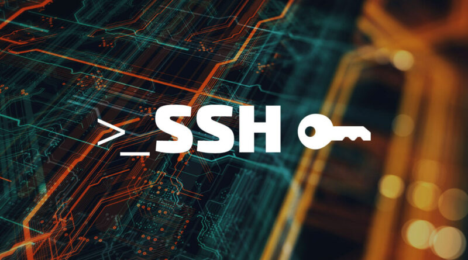
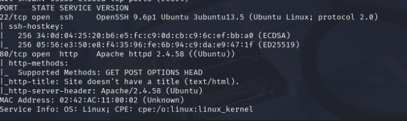
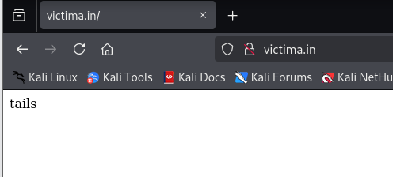
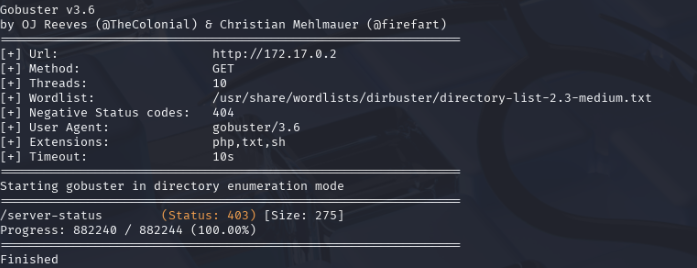
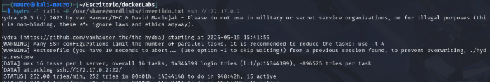
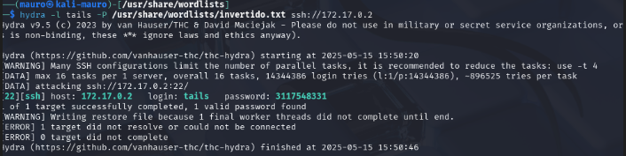
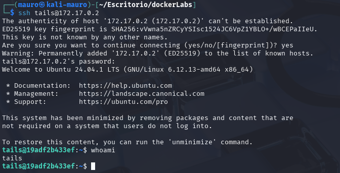
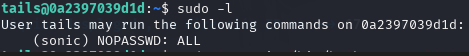
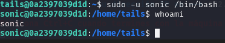
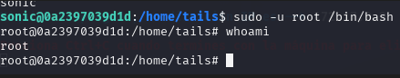

En esta práctica resolveremos una máquina de **DockerLabs** enfocada en la explotación del servicio **SSH (puerto 22)** mediante un ataque de **fuerza bruta**. A lo largo del proceso iremos encontrando distintas **pistas** que nos guiarán hacia la solución, incluyendo la necesidad de **invertir y formatear un diccionario** para utilizarlo de forma efectiva y así lograr vulnerar la máquina.



Empezaremos haciendo un escaneo de puertos a la maquina **Hedgehog** con la herramienta **Nmap**

```
 sudo nmap -p- --open -sSCV --min-rate 5000 -Pn -n -v 172.17.0.2 -oN escaneo
```

| Parte             | Significado                                                                                                                                                                                               |
| ----------------- | --------------------------------------------------------------------------------------------------------------------------------------------------------------------------------------------------------- |
| `sudo`            | Se necesita privilegios de administrador para algunos tipos de escaneo (como los de tipo SYN).                                                                                                            |
| `nmap`            | Herramienta para escaneo de redes y puertos.                                                                                                                                                              |
| `-p-`             | Escanea **todos los puertos** (del 1 al 65535).                                                                                                                                                           |
| `--open`          | Muestra **solo los puertos abiertos**, omite los cerrados y filtrados.                                                                                                                                    |
| `-sSCV`           | Combinación de opciones:  <br>• `-sS` = Escaneo **SYN** (rápido y sigiloso).  <br>• `-sC` = Usa **scripts NSE básicos**, equivalente a `--script=default`.  <br>• `-sV` = Detecta versiones de servicios. |
| `--min-rate 5000` | Intenta enviar **al menos 5000 paquetes por segundo** (muy rápido). ⚠️ Puede generar falsos positivos si la red no lo soporta bien.                                                                       |
| `-Pn`             | No hace **ping previo** al host (asume que está vivo). Útil si ICMP está bloqueado.                                                                                                                       |
| `-n`              | No resuelve nombres DNS (más rápido).                                                                                                                                                                     |
| `-v`              | Modo **verborreico**: muestra más detalles durante el escaneo.                                                                                                                                            |
| `172.17.0.2`      | IP del objetivo.                                                                                                                                                                                          |
| `-oN escaneo`     | Guarda el resultado en un archivo llamado `escaneo` en formato **legible para humanos** (normal output).                                                                                                  |

El escaneo nos muestra que esta maquina tiene 2 puerto abierto.

* puerto 22 ssh version 9.6
* puerto 80 http



Revisaremos que esta corriendo por el puerto 80. una pagina el mensaje **tails** cola(s) en ingles. También revise el código fuente de la pagina pero no se encontró nada raro



Realizare un fuzzing con la herramienta gobuster para ver si la pagina esconde directorios ocultos y le especificaremos que busque archivos **.php, .txt y .sh.** Para ello usaremos el siguiente comando:


```
gobuster dir -u http://172.17.0.2 -w /usr/share/wordlists/dirbuster/directory-list-2.3-medium.txt -x php,txt,sh`
```

Lamentablemente no se encontró nada. Anteriormente habíamos encontrado la frase **tails** podría ser el nombre de algún usuario, ademas de tener el puerto 22 ssh abierto por lo cual podríamos intentar hacer fuerza bruta con hydra y ver si existe alguna password para ese usuario



Usaremos la herramienta **hydra** para hacer fuerza bruta. Para eso usaremos el siguiente comando:

```
hydra -l tails -P /usr/share/wordlists/rockyou.txt ssh://172.17.0.2
```

Ha pasado un tiempo haciendo la búsqueda con **hydra** pero sin resultados.. Investigando un poco aparte de que el significado de **tails** es cola también tiene como significado extremo o final de algo... lo que llega uno a sacar como conclusión que la password tiene que estar al final de la wordlist rockyou por lo que deberemos invertir el diccionario, para probar suerte nuevamente con **hydra**



Para eso usaremos el siguiente comando para crear un diccionario nuevo llamado **invertido.txt** que sera lo mismo que el diccionario rockyou pero al revés

```
tac rockyou.txt >> invertir.txt
```

Luego eliminaremos los espacios que quedan dentro del diccionario nuevo. para ello usaremos este comando:

```
sed -i 's/ //g' invertido.txt
```

Ahora con el diccionario nuevo y formateado haremos nuevamente el ataque con **hydra** con el siguiente comando:

Asegurar de cambiar el diccionario rockyou por el nuevo diccionario **invertido.txt**
```
hydra -l tails -P /usr/share/wordlists/invertido.txt ssh://172.17.0.2
```

Esta vez si se pudo encontrar la password del usuario **tails**

* **user: tails**
* **password: 3117548331**



Estamos dentro de la maquina victima siendo el usuario **tails**



Probaremos el comando `sudo -l` el cual nos dirá si hay binarios vulnerables. Nos dice que hay un usuario (sonic) con mas privilegios que podríamos escalar.



Entonces usaremos el truco de `/bin/bash` este comando sirve para abrir una terminal (shell) como si fuera el usuario sonic en este caso. Para ello usamos el comando:

```
sudo -u sonic /bin/bash
```



Ahora usaremos el mismo comando pero  para ser **root**. Para ello usamos el comando:

`sudo -u root /bin/bash`

| Parte del comando | Significado                                                                  |
| ----------------- | ---------------------------------------------------------------------------- |
| `sudo`            | Ejecuta un comando con privilegios elevados                                  |
| `-u root`         | Especifica que se ejecute como el usuario `root` (no como tu usuario normal) |
| `/bin/bash`       | Es la shell que se va a abrir, una sesión de bash                            |

Logramos ser **root**



