En esta práctica resolveremos una máquina de **DockerLabs** donde identificaremos un **error común en el desarrollo de aplicaciones web**: la inclusión de **comentarios sensibles en el código**. Estos comentarios pueden contener información crítica como **usuarios y contraseñas**, lo que representa una vulnerabilidad grave y fácilmente explotable para comprometer la maquina.


Empezaremos haciendo un escaneo de puertos a la maquina **Vacaciones** con la herramienta **Nmap**

```
 sudo nmap -p- --open -sSCV --min-rate 5000 -Pn -n -v 172.17.0.2 -oN escaneo
```

| Parte             | Significado                                                                                                                                                                                               |
| ----------------- | --------------------------------------------------------------------------------------------------------------------------------------------------------------------------------------------------------- |
| `sudo`            | Se necesita privilegios de administrador para algunos tipos de escaneo (como los de tipo SYN).                                                                                                            |
| `nmap`            | Herramienta para escaneo de redes y puertos.                                                                                                                                                              |
| `-p-`             | Escanea **todos los puertos** (del 1 al 65535).                                                                                                                                                           |
| `--open`          | Muestra **solo los puertos abiertos**, omite los cerrados y filtrados.                                                                                                                                    |
| `-sSCV`           | Combinación de opciones:  <br>• `-sS` = Escaneo **SYN** (rápido y sigiloso).  <br>• `-sC` = Usa **scripts NSE básicos**, equivalente a `--script=default`.  <br>• `-sV` = Detecta versiones de servicios. |
| `--min-rate 5000` | Intenta enviar **al menos 5000 paquetes por segundo** (muy rápido). ⚠️ Puede generar falsos positivos si la red no lo soporta bien.                                                                       |
| `-Pn`             | No hace **ping previo** al host (asume que está vivo). Útil si ICMP está bloqueado.                                                                                                                       |
| `-n`              | No resuelve nombres DNS (más rápido).                                                                                                                                                                     |
| `-v`              | Modo **verborreico**: muestra más detalles durante el escaneo.                                                                                                                                            |
| `172.17.0.2`      | IP del objetivo.                                                                                                                                                                                          |
| `-oN escaneo`     | Guarda el resultado en un archivo llamado `escaneo` en formato **legible para humanos** (normal output).                                                                                                  |

El escaneo nos muestra que esta maquina tiene 2 puerto abierto.

* puerto 22 ssh version 7.6
* puerto 80 http

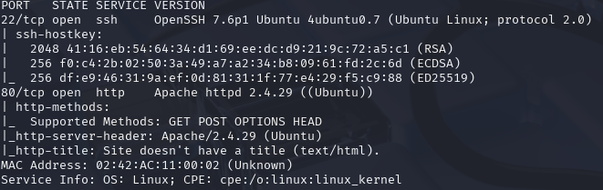

Revisaremos que servicio http esta corriendo por el puerto 80. Es una pagina en blanco, pero al revisar el código fuente se puede ver un comentario.

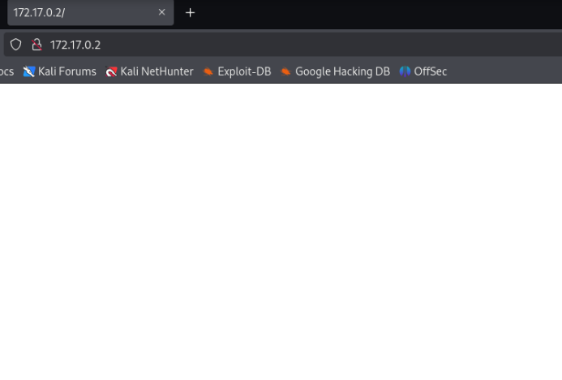

Podrían ser 2 posibles usuarios **Juan** y **Camilo**

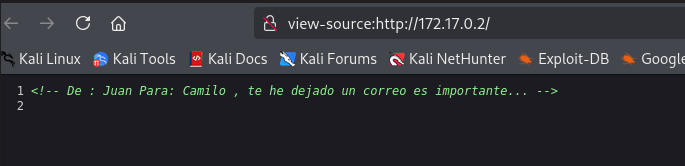

Usare la herramienta **gobuster** para hacer un fuzzing en la pagina y ver si este tiene directorios ocultos. Usare el siguiente comando:

`gobuster dir -u http://172.17.0.2 -w /usr/share/wordlists/dirbuster/directory-list-2.3-medium.txt -x php,txt,sh`

No se encontró mucho aparte de la clásica **server-status** se encontró otro directorio llamado **javascript** con el código de estado **301** que en pocas palabras quiere decir que el contenido de ese directorio fue movido. 

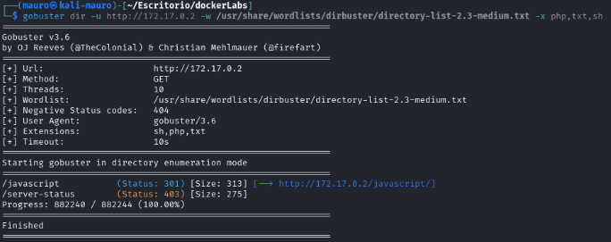

Vamos a usar la herramienta **hydra** para ver si estos 2 usuarios que encontramos tienen credenciales. Para ello usaremos el siguiente comando:

```
hydra -l juan -P /usr/share/wordlists/rockyou.txt ssh://172.17.0.2
```

```
hydra -l camilo -P /usr/share/wordlists/rockyou.txt ssh://172.17.0.2
```


Al probar con el primer usuario **juan** no encontró nada después de dejarlo un buen tiempo escaneando... Pero con el otro usuario **camilo** si encontró credenciales.

* **user: camilo**
* **password: password1**

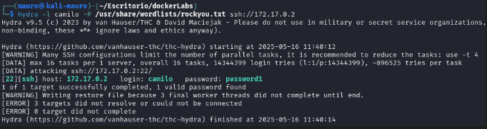

Probaremos estas credenciales en el puerto 22 ssh ya que esta abierto. Pudimos tener acceso.

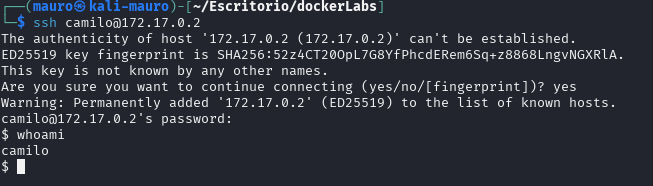

Probamos el comando `sudo -l` para ver si tenemos acceso a binarios vulnerables, pero nos pide una password, al usar el mismo password de camilo  **"password1"** no nos funciona

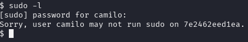

Luego de estar un rato buscando, encontramos un archivo llamado **correo.txt** en el directorio **mail** y tiene sentido ya que el primer mensaje que encontramos nos decía de que juan nos había dejado un correo.

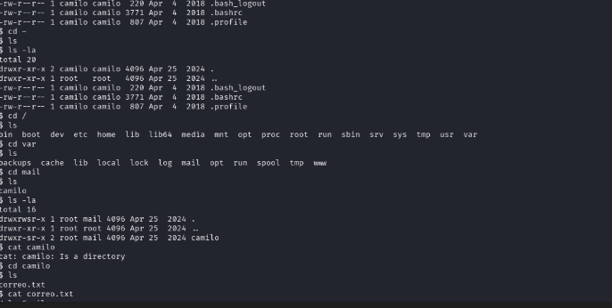

También existe una forma mas rápida para hacer búsquedas de archivos con el comando:

```
find / -type f -name "*.txt"
```

| Parte           | Significado                                                                 |
| --------------- | --------------------------------------------------------------------------- |
| `find`          | Comando para **buscar archivos o directorios** en el sistema.               |
| `/`             | El directorio **donde comienza la búsqueda** (en este caso, desde la raíz). |
| `-type f`       | Busca solo **archivos** (no carpetas).                                      |
| `-name "*.txt"` | Filtra por nombre: solo los que **terminan en `.txt`**.                     |


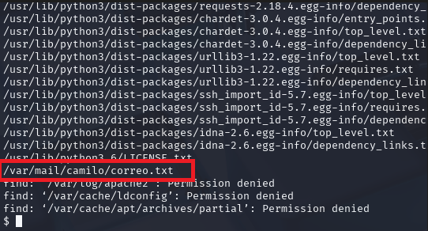

Al abrir el archivo, nos deja unas credenciales.

* **2k84dicb**

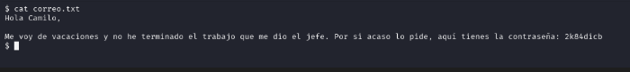

Al tener estas credenciales nuevas, podríamos intentar entrar por ssh con el usuario **juan**. Tenemos exito.

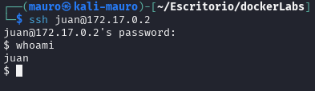

Al aplicar un `sudo -l` nos dice que podemos obtener privilegios elevados con ruby.

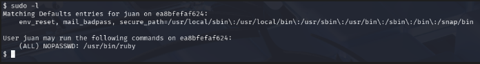

Consultamos la pagina https://gtfobins.github.io/gtfobins/ruby/#sudo para ver como poder hacerlo. Nos dice que solo tenemos que ejecutar ese comando.

```
sudo ruby -e 'exec "/bin/sh"'
```

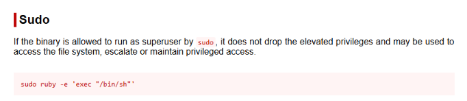

Ya con esto logramos ser **root**

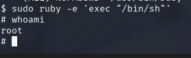

