Vamos a resolver una máquina de la plataforma Dockerlabs llamada **"Injection"**. En este laboratorio, exploraremos cómo una **inyección SQL** puede ser utilizada para vulnerar el sistema y, posteriormente, **tomar el control de la máquina**


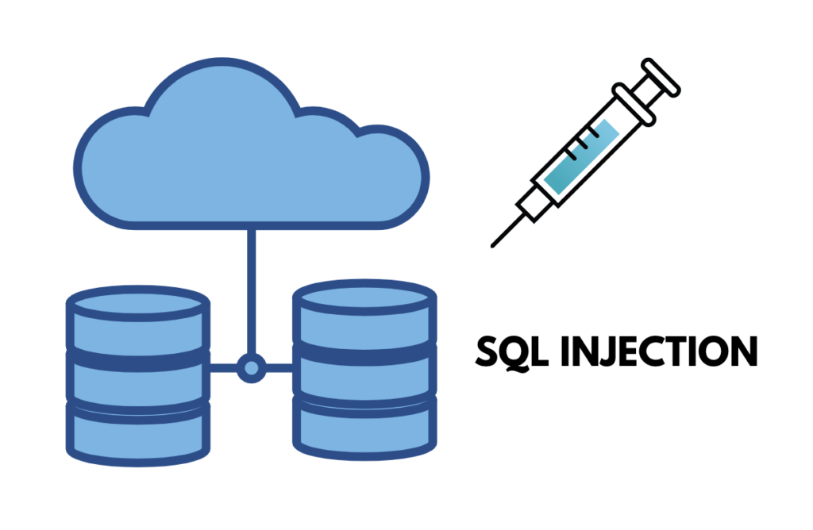

--------------------------------------------------------------------------------------------------------
Empezaremos haciendo un escaneo de puertos a la maquina **Injection** con la herramienta **Nmap**

```
 sudo nmap -p- --open -sSCV --min-rate 5000 -Pn -n -v 172.17.0.2 -oN escaneo
```

| Parte             | Significado                                                                                                                                                                                               |
| ----------------- | --------------------------------------------------------------------------------------------------------------------------------------------------------------------------------------------------------- |
| `sudo`            | Se necesita privilegios de administrador para algunos tipos de escaneo (como los de tipo SYN).                                                                                                            |
| `nmap`            | Herramienta para escaneo de redes y puertos.                                                                                                                                                              |
| `-p-`             | Escanea **todos los puertos** (del 1 al 65535).                                                                                                                                                           |
| `--open`          | Muestra **solo los puertos abiertos**, omite los cerrados y filtrados.                                                                                                                                    |
| `-sSCV`           | Combinación de opciones:  <br>• `-sS` = Escaneo **SYN** (rápido y sigiloso).  <br>• `-sC` = Usa **scripts NSE básicos**, equivalente a `--script=default`.  <br>• `-sV` = Detecta versiones de servicios. |
| `--min-rate 5000` | Intenta enviar **al menos 5000 paquetes por segundo** (muy rápido). ⚠️ Puede generar falsos positivos si la red no lo soporta bien.                                                                       |
| `-Pn`             | No hace **ping previo** al host (asume que está vivo). Útil si ICMP está bloqueado.                                                                                                                       |
| `-n`              | No resuelve nombres DNS (más rápido).                                                                                                                                                                     |
| `-v`              | Modo **verborreico**: muestra más detalles durante el escaneo.                                                                                                                                            |
| `172.17.0.2`      | IP del objetivo.                                                                                                                                                                                          |
| `-oN escaneo`     | Guarda el resultado en un archivo llamado `escaneo` en formato **legible para humanos** (normal output).                                                                                                  |

El escaneo nos muestra que esta maquina tiene 2 puertos abiertos.

* Puerto 22 SSH en la versión **8.9**
* Puerto 80 donde esta corriendo un servicio **Http**

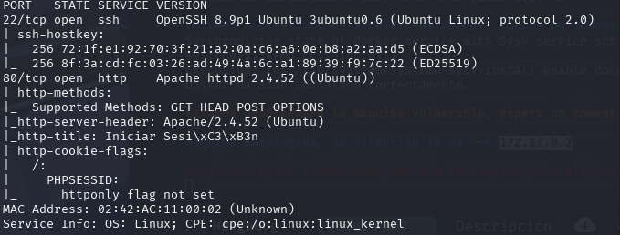


Revisaremos lo que esta corriendo por el puerto 80. Pero antes le asignaremos a la dirección IP **172.17.0.2** un dominio propio llamado **injection.in**  mediante el directorio `etc/hosts` para que en vez de poner la IP en el navegador pongamos el dominio asignado actualmente.

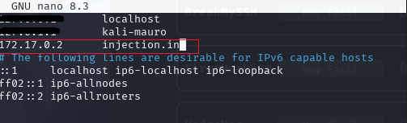


Al ingresar al dominio nos mostrara un **Login** donde nos pedirá unas credenciales. Al no disponer de esas credenciales, trataremos de usar credenciales por defecto como **admin, root, 123, etc**. 


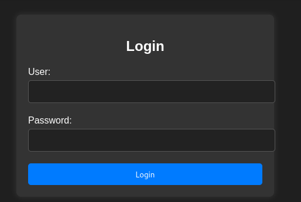


Sin tener suerte ingresare una ¨ ´ ¨ para ver si nos presenta un error. Efectivamente nos tira un error. Este error es susceptible a **SQL INJECTION**. También como dato **extra** podemos ver que esta usando como base de datos MariaDB.


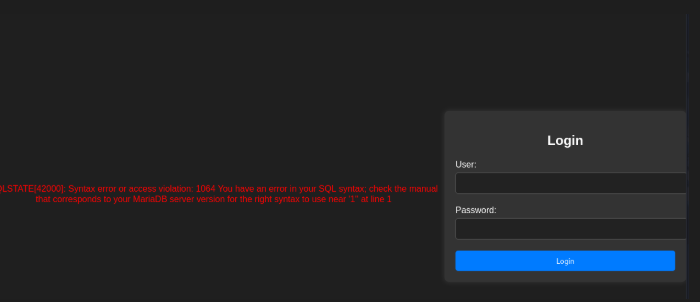


## Que es una SQL INJECTION?

**SQL INJECTION** que en palabras simples es un tipo de ciberataque encubierto en el cual un hacker inserta código propio en un sitio web con el fin de quebrantar las medidas de seguridad y acceder a datos protegidos.

Probaremos en poner en el campo **user** el siguiente comando `'or 1=1 -- -'` y en el campo **password** cualquier cosa.

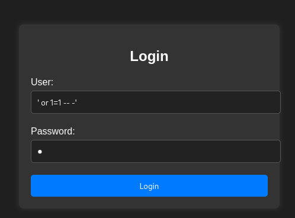

Al entrar nos muestra una ventana con las siguientes credenciales.

* Dylan
* KJSDFG789FGSDF78


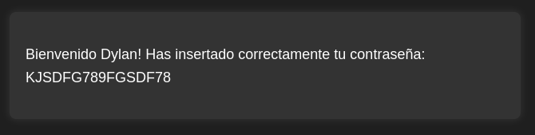


Anteriormente en el escaneo de puertos, teníamos abierto el puerto **22 SSH** lo cual al tener estas credenciales podríamos probar y ver que pasa.
Pudimos entrar. Ahora trataremos de buscar dentro del sistema cosas que nos puedan llamar la atención. 


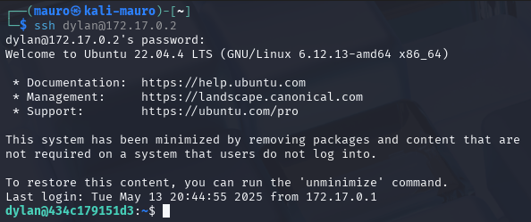


Al indagar dentro de la maquina victima notamos unos archivos que hacen llamar la atención:

* Acceso_valido_dylan.php
* Config.php
* Index.php


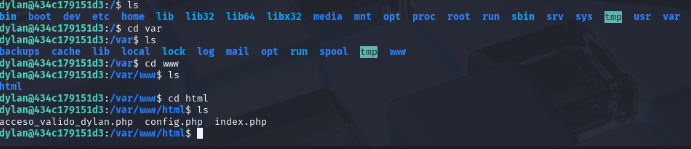


Al abrir el archivo **Config.php** nos muestra unas credenciales de una base de datos. Podría ser de la base de datos montada en MariaDB por el error del login


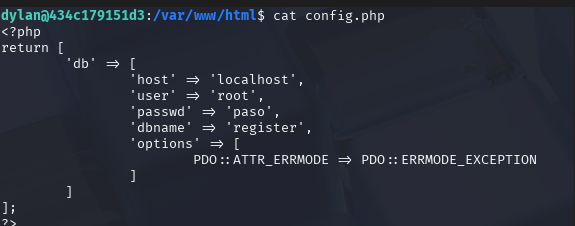


Probaremos las credenciales con el siguiente comando`mysql -uroot -ppaso` para entrar a la BD. Tenemos éxito. Ahora trataremos de explorar un poco y ver que se puede encontrar.


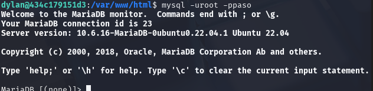


Al revisar nos encontramos con las credenciales que ya tenemos de dylan. Nada relevante.


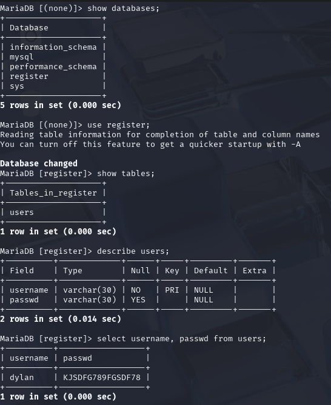


Ahora buscaremos binarios que tengan los permisos SUID con este comando 
```
find / -perm -4000 2>/dev/null
```

| Parte         | Significado                                                   |
| ------------- | ------------------------------------------------------------- |
| `find`        | Comando para buscar archivos.                                 |
| `/`           | Inicia la búsqueda desde la raíz del sistema (todo el disco). |
| `-perm -4000` | Busca archivos con el **bit SUID** activado.                  |
| `2>/dev/null` | Oculta los **mensajes de error** (como "Permiso denegado").   |

En el siguiente resultado nos interesa `/usr/bin/env` ya que esto nos puede dar acceso como **root** en la maquina victima. 


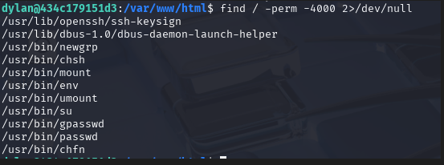


Consultando la pagina https://gtfobins.github.io/gtfobins/env/ nos dice la forma de como ganar acceso root con este SUID.

Tenemos que poner el siguiente comando en la terminal  `./env /bin/sh -p` para asi ser root y ganar control total de la maquina.


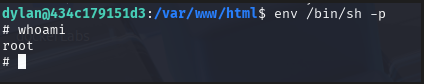


